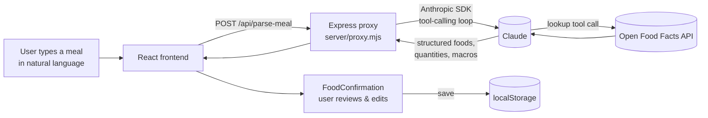

# Architecture

Calorie Snap is a single React/TypeScript frontend that runs unchanged across
web, Electron and Capacitor, plus a thin local proxy that keeps the Anthropic
API key off the client. There is no application database — meal entries live in
`localStorage` for a fast, backend-free first version.

## Component map

```
calorie-snap/
├── src/                     React 19 + TypeScript frontend (Vite)
│   ├── main.tsx             app entry
│   ├── App.tsx              top-level state, day view, meal list
│   ├── components/
│   │   ├── FoodConfirmation.tsx   review AI-parsed foods before saving
│   │   ├── ProfileSetup.tsx       calorie/macro goals
│   │   └── ProgressRing.tsx       daily progress visual
│   ├── services/
│   │   ├── logService.ts          localStorage meal-log persistence
│   │   └── profileService.ts      localStorage profile/goal persistence
│   └── types/index.ts       shared domain types
├── server/                  local proxy (Node, not bundled into the client)
│   ├── proxy.mjs            Express server; holds ANTHROPIC_API_KEY
│   ├── mealParser.mjs       bounded multi-turn tool-calling loop
│   └── eval/                8-case prompt-evaluation harness
├── electron/main.cjs        Electron desktop host
├── capacitor.config.ts      iOS / Android native shell config
└── public/                  PWA icons and static assets
```

## Data flow: natural-language meal logging



1. The frontend never sees the API key. It calls the proxy's `/api/parse-meal`
   endpoint.
2. `mealParser.mjs` runs a **bounded** multi-turn tool-calling loop: it asks the
   model to structure the meal and, when nutrition grounding is needed, calls
   Open Food Facts before returning.
3. The result is always **reviewable** — `FoodConfirmation` shows the parsed
   foods, quantities, calories and macros, and the user confirms or edits before
   anything is saved. Users remain responsible for checking values.
4. Confirmed entries persist to `localStorage` via `logService`. No server-side
   storage, accounts or sync.

## Platform strategy

One web bundle, three delivery shells:

| Platform | Shell | Notes |
|---|---|---|
| Web / PWA | Browser + `vite-plugin-pwa` | Installable; offline shell for the UI |
| macOS | Electron (`electron/main.cjs`) | Packaged as a `.dmg` via electron-builder |
| iOS / Android | Capacitor (`capacitor.config.ts`) | Native wrapper around the same bundle |

Because the AI parser lives in the proxy rather than the client, native builds
must be able to reach a running proxy instance (`npm run proxy`, or
`npm run proxy:lan` for on-device testing over the LAN). The barcode/nutrition
lookups against Open Food Facts are the only other network dependency, and the
app degrades to manual entry when a barcode is unavailable or unrecognised.

## Design constraints

- **Key isolation.** The Anthropic key is only ever held by the proxy; the
  client bundle carries no secret and calls a relative `/api` path.
- **Human-in-the-loop.** AI output is a draft, never an auto-saved fact.
- **Backend-free v1.** `localStorage` keeps the first version simple; a shared
  backend and cloud sync are explicitly out of scope for now (see `handoff.md`).
